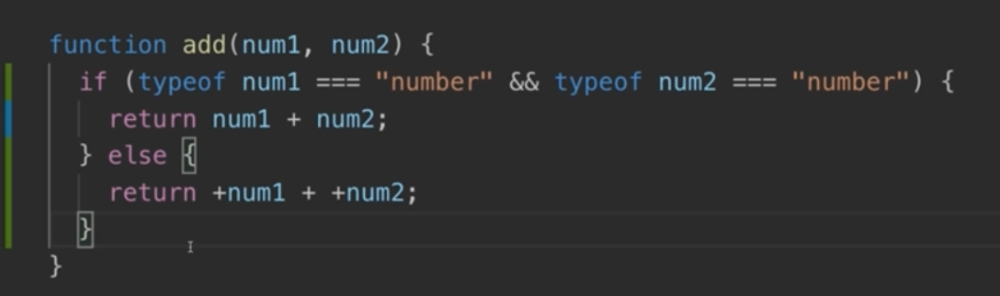

## What  is TypeScript

typescript is a superset of javascript. Which adds new features.
## why typescript


## let's see a example

```html
<!DOCTYPE html>
<html lang="en">
  <head>
    <meta charset="UTF-8" />
    <meta name="viewport" content="width=device-width, initial-scale=1.0" />
    <meta http-equiv="X-UA-Compatible" content="ie=edge" />
    <title>Understanding TypeScript</title>
    <script src="js-only.js" defer></script>
  </head>
  <body>
    <input type="number" id="num1" placeholder="Number 1" />
    <input type="number" id="num2" placeholder="Number 2" />
    <button>Add!</button>
  </body>
</html>

```
```js
const button = document.querySelector("button");
const input1 = document.getElementById("num1");
const input2 = document.getElementById("num2");

function add(num1, num2) {
  return num1 + num2;
}

button.addEventListener("click", function() {
  console.log(add(input1.value, input2.value));
});

```
## output


we can do this 


but we can make it so that we can't pass other inputs except numbers.

## Let's use typescript
let's install typescript globally
```shell
npm install -globally typescript
```
let's create a ts file

```ts
const button = document.querySelector("button");
const input1 = document.getElementById("num1")! as HTMLInputElement;
const input2 = document.getElementById("num2")! as HTMLInputElement;

function add(num1:number, num2:number) {
    return num1 + num2;
}

button.addEventListener("click", function() {
    console.log(add(+input1.value, +input2.value));
});

```
**Note**
```
! mark denotes the values are not null
+ converts to numbers
```
let's compile the code back to js
```js
var button = document.querySelector("button");
var input1 = document.getElementById("num1");
var input2 = document.getElementById("num2");
function add(num1, num2) {
    return num1 + num2;
}
button.addEventListener("click", function () {
    console.log(add(+input1.value, +input2.value));
});

```
**output**


## TypeScript Advantages - Overview
- we can reduce errors by using types
- we can get better autocomplete by using typescript
- next gen js can be used
- interfaces and generics
- Decorators
- very configurable

## course outline
