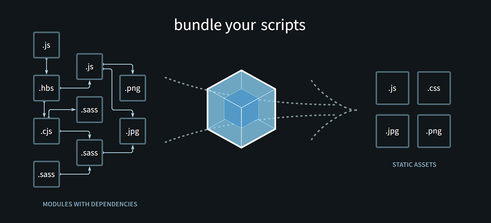

# Webpack Configuration

## 1 - Module Introduction



## 2 - What is Webpack Why do we need it

[official web pack documentation](https://webpack.js.org/concepts/)

## 3 - A Note About NodeJS

In the next lecture, we will use a third-party tool (Webpack) to create a new project. This tool, under the hood, uses NodeJS - a software which you need to download as part of the next lecture.

## 4 - Installing Webpack Important Dependencies, 5 - Adding Entry Output Configuration,6 - Adding TypeScript Support with the ts-loader,Package,7 - Finishing the Setup Adding webpack-dev-server,

```bash
npm i -D webpack webpack-cli typescript ts-loader webpack-dev-server
```

remove this from the tsconfig file
because webpack is handling this

```json
    // "rootDir": "./src",
```

then create a webpack.config.js file

```js
const path = require("path");
module.exports = {
  // entry file
  entry: "./src/app.ts",
  //   environment
  mode: "development",
  //   output details
  output: {
    path: path.resolve(__dirname, "dist"),
    filename: "bundle.js",
  },
  //   enable sourceMaps
  devtool: "eval",
  // which files to bundle using this plugin
  module: {
    rules: [{ test: /\.ts$/, use: "ts-loader", exclude: /node_modules/ }],
  },
  //   look for this files
  resolve: {
    extensions: [".ts", ".js"],
  },
  //   web-pack-dev-server configs
  devServer: {
    static: {
      directory: path.join(__dirname),
    },
    compress: true,
    port: 9000,
  },
};
```

then add the script

```json
  "scripts": {
    "start": "webpack-dev-server",
    "build": "webpack"
  },
```

## 8 - Adding a Production Workflow

this will clean the dist folder every time we do a new build

```bash
npm i -D clean-webpack-plugin
```

webpack.config.prod.js

```js
const path = require("path");
const { CleanWebpackPlugin } = require("clean-webpack-plugin");
module.exports = {
  entry: "./src/app.ts",
  mode: "development",
  output: {
    path: path.resolve(__dirname, "dist"),
    filename: "bundle.js",
  },
  //   devtool: "none",
  module: {
    rules: [{ test: /\.ts$/, use: "ts-loader", exclude: /node_modules/ }],
  },
  resolve: {
    extensions: [".ts", ".js"],
  },
  plugins: [new CleanWebpackPlugin()],
};
```

run this command

```bash
npm run webpack --config webpack.config.prod.js
```
