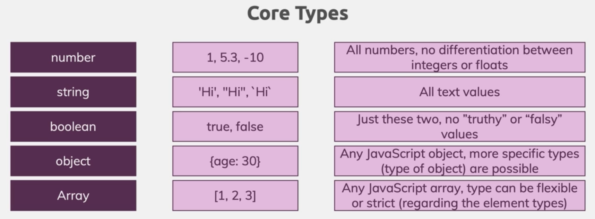

## Core Types


let's see how typescript can help during development

```ts
function add(num1: number, num2: number) {
  return num1 + num2;
}

const number1 = 12;
const number2 = 56;

const result = add(number1, number2);
console.log(result);
```

here is we pass a 'string' or boolean we will get an error during the development.
this will give us time to fix the code during development.

javascript is dynamically types,so we get the errors at run time.
typescript is static types so we the errors during development.

in javascript all numbers are floats by defaults.

```ts
function add(
  num1: number,
  num2: number,
  showResult: boolean,
  resultPhase: string
) {
  const result = num1 + num2;
  if (showResult) console.log(resultPhase + result);
  return num1 + num2;
}

const number1 = 12;
const number2 = 56;
const printResult = true;
const resultPhrase = 'Result is ';

const result = add(number1, number2, printResult, resultPhrase);
```

here we are creating a method which accepts 4 arguments.
which are type number,boolean,string.
from this example we can see how to use types with functions.
we create the result variable because the return statement of the log has a string
in the start. if we provide the number after the string it will concatinate the two numbers into string so
it can add those converted strings to the first number.

## Objects in typescript

```ts
const person: {
  name: string;
  age: number;
} = {
  name: 'chamara',
  age: 12,
};

console.log(person.age);
console.log(person.name);
```

in typescript, we can explicitly define the object or typescript can infer the object types.

**🔥Note🔥**

In TypeScript, you work with types like string or number all the times.

Important: It is string and number (etc.), NOT String, Number etc.

The core primitive types in TypeScript are all lowercase!

**nested objects**
Of course object types can also be created for nested objects.

Let's say you have this JavaScript object:

```js
const product = {
  id: 'abc1',
  price: 12.99,
  tags: ['great-offer', 'hot-and-new'],
  details: {
    title: 'Red Carpet',
    description: 'A great carpet - almost brand-new!',
  },
};
```

This would be the type of such an object:

```ts
{
    id: string;
    price: number;
    tags: string[];
    details: {
        title: string;
        description: string;
    }
}
```

So you

## Arrays in typescript

```ts
const person = {
  name: 'chamara',
  age: 12,
  hobbies: ['sports', 'cooking'],
};

let favouriteSports: string[];
favouriteSports = ['Sports'];

console.log(person.age);
console.log(person.name);

for (const hobby of person.hobbies) {
  console.log(hobby.toUpperCase());
}
```

here we are adding a hobbies array to the person object.
in the favourite sports section we can see how to set explicit types for an Array.
inside the for loop we can see that the hobby is identified as a string because of the
type inference.

types we have talked about



## Tuples in typescript

```ts
const person: {
  name: string;
  age: number;
  hobbies: string[];
  role: [number, string];
} = {
  name: 'chamara',
  age: 12,
  hobbies: ['sports', 'cooking'],
  role: [2, 'author'],
};
//this is not allowed

// person.role[0] = 'sfsdf';
// person.role[2] = 'sfsdf';

// this is allowed

person.role[1] = 'sfsdf';
person.role.push('ksgdfkgsdf');
```

when u want an array with exact width and know the types advance u can use tuples.
be careful about the map function.

### Enums

```ts
enum Role {
  ADMIN,
  READONLY,
  AUTHOR,
}

const person = {
  name: 'chamara',
  age: 12,
  hobbies: ['sports', 'cooking'],
  role: Role.AUTHOR,
};
```

we can provide custom values for the enums.
these are reusable constants we reuse inside the application.

### any type

always try to avoid any if u can.
anything u passed as any tsc can't check for any errors.

```ts
let favouriteSports: any[];
```

### Union Types

```ts
function combine(input1: number | string, input2: number | string) {
  let result;
  if (typeof input1 === 'number' && typeof input2 === 'number') {
    result = input1 + input2;
  } else {
    result = input1.toString() + input2.toString();
  }
  return result;
}

console.log(combine(12, 34));
console.log(combine('chamara', 'weerasinghe'));
```

by using union type we can add more flexibility to the application.

### using Literal types

```ts
function combine(
  input1: number | string,
  input2: number | string,
  resultsConversion: 'as-number' | 'as-string'
) {
  let result;
  if (
    typeof input1 === 'number' &&
    typeof input2 === 'number' &&
    resultsConversion === 'as-number'
  ) {
    result = +input1 + +input2;
  } else {
    result = input1.toString() + input2.toString();
  }
  return result;
}

console.log(combine(12, 34, 'as-number'));
console.log(combine(12, 34, 'as-string'));
console.log(combine('chamara', 'weerasinghe', 'as-string'));
```

we can use literal types to limit the types of inputs we can parse to the function arguments

### Type aliases custom types

```ts
type Combine = number | string;
type versionDescriptor = 'as-number' | 'as-string';
function combine(
  input1: Combine,
  input2: Combine,
  resultsConversion: versionDescriptor
) {
  let result;
  if (
    typeof input1 === 'number' &&
    typeof input2 === 'number' &&
    resultsConversion === 'as-number'
  ) {
    result = +input1 + +input2;
  } else {
    result = input1.toString() + input2.toString();
  }
  return result;
}
```

we can reduce the code repeat by using the type alise

### Type void and undefined

```ts
function add(num1: number, num2: number) {
  return num1 + num2;
}

function printResult(num: number): void {
  console.log('Result is :' + num);
}

printResult(add(23, 2));

let someValue: undefined;
```

if we return a void function we will get undefined.

### functions as types

```ts
function add(num1: number, num2: number) {
  return num1 + num2;
}

let combineValue: (a: number, b: number) => number;

combineValue = add;

console.log(combineValue(12, 3));
```

### callback functions

```ts
function addAndHandle(num1: number, num2: number, cb: (num: number) => void) {
  const result = num1 + num2;
  cb(result);
}

addAndHandle(1, 2, (result) => {
  console.log(result);
});
```

### Type Unknown

```ts
let userInput: unknown;
let userName: string;

if (typeof userInput === 'string') {
  userName = userInput;
}
```

this can be used when you don't know exactly coming from the variable but u know eventually what u want to do with it.

### type never

```ts
function generateError(message: string, code: number): never {
  throw { message, code };
}

generateError('Error', 500);
```
this will never return anything because this will crash the script.