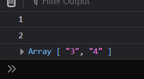

### 1 - Module Introduction

next-gen js features

### 2 - let and const

```ts
const userName = 'abc';

let age = 12;

age = 34;
```

```ts
function add(num1: number, num2: number) {
  let result;
  result = num1 + num2;
  return result;
}
```

let is block scoped
var is global scoped


```js
if (10 > 3) {
  var x = true;
}

console.log(x);
```

this will work in javascript.

### 3 - Arrow Functions

this is the shorter syntax

```ts
const addArrow = (a: number, b: number): number => a + b;
```


examples

```ts
const addArrow = (a: number, b: number): number => a + b;

const printValue: (a: string | number) => void = (value) => console.log(value);

const button = document.querySelector('button');

button?.addEventListener('click', () => {
  console.log('clicked');
});
```

### 4 - Default Function Parameters

has to be in order

either last or all the values need the default value

```ts
const addArrow = (a: number, b: number = 2): number => a + b;

addArrow(1);
```

but this wont

```ts
const addArrow = (a: number = 2, b: number): number => a + b;

addArrow(1);
```

### 5 - The Spread Operator ()

```ts
const hobbies = ['1', '2', '3'];
console.log(hobbies);

const allTheHobbies = ['4', '5', '6', ...hobbies];
console.log(allTheHobbies);

hobbies.push(...allTheHobbies);

console.log(hobbies);

const person = {
  x: 12,
  y: 45,
};

const personClone = {
  ...person,
};

console.log(personClone);
```

### 6 - Rest Parameters

```ts
const add = (...numbers: number[]) => {
  return numbers.reduce((result, value) => {
    return result + value;
  }, 0);
};

console.log(add(12, 1, 2, 3));
```

we can use tuples as well

```ts
const add = (...numbers: [number, number, number, number]) => {
  return numbers.reduce((result, value) => {
    return result + value;
  }, 0);
};

console.log(add(12, 1, 2, 3));
```

### 7 - Array Object Destructuring

```ts
const [a, b, ...rest] = ['1', '2', '3', '4'];

console.log(a);
console.log(b);
console.log(rest);
```



order is not important
names can be anything
object

```ts
const person = {
  x: 12,
  y: 45,
};

const { x, y } = person;
console.log(x);
console.log(y);
```

order is not important
names has to be property names

```ts
const person = {
  x: 12,
  y: 45,
};

const { x: override, y } = person;
console.log(override);
console.log(y);
```

can override properties names in destructuring
this is aliasing

### 8 - How Code Gets Compiled Wrap Up
