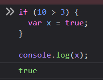

### 1 - Module Introduction

next-gen js features

### 2 - let and const

```ts
const userName = 'abc';

let age = 12;

age = 34;
```

```ts
function add(num1: number, num2: number) {
  let result;
  result = num1 + num2;
  return result;
}
```

let is block scoped
var is global scoped



```js
if (10 > 3) {
  var x = true;
}

console.log(x);
```

this will work in javascript.

### 3 - Arrow Functions

this is the shorter syntax

```ts
const addArrow = (a: number, b: number): number => a + b;
```


### 4 - Default Function Parameters

### 5 - The Spread Operator ()

### 6 - Rest Parameters

### 7 - Array Object Destructuring

### 8 - How Code Gets Compiled Wrap Up
