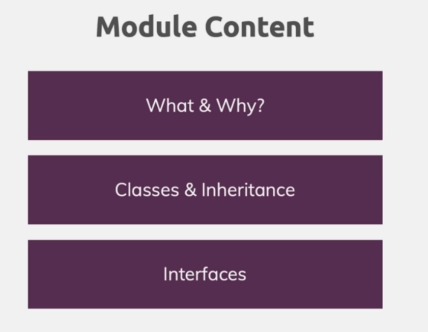
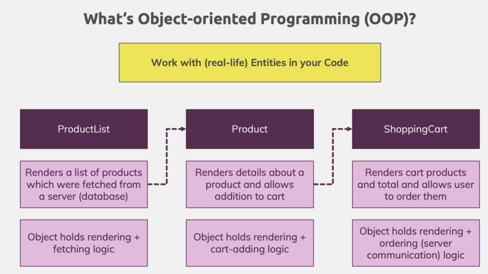

### 1 - Module Introduction

intro to classes and interfaces


### 2 - What are Classes


we have objects which holds properties and methods.

### 3 - Creating a First Class

```ts
class Department {
  firstName: string = 'Default';
  constructor(n: string) {
    this.firstName = n;
  }
}

const accounting = new Department('Accounting');

console.log(accounting);
```

output

```
{
  "firstName": "Accounting"
}
```

we get a object as a return.

### 4 - Compiling to JavaScript

if we use es5 JavaScript we can see the constructor functions are used

```js
'use strict';
var Department = (function () {
  function Department(n) {
    this.firstName = 'Default';
    this.firstName = n;
  }
  return Department;
})();
var accounting = new Department('Accounting');
console.log(accounting);
```

### 5 - Constructor Functions The this Keyword

```ts
class Department {
  firstName: string = 'Default';
  constructor(n: string) {
    this.firstName = n;
  }

  describe(this: Department) {
    console.log('department : ' + this.firstName);
  }
}

const accounting = new Department('Accounting');

console.log(accounting);

const accountingCopy = {
  firstName: 'DUMMY',
  describe: accounting.describe,
};

accountingCopy.describe();
```

this keyword context always refer to the object we are calling

### 6 - private and public Access Modifiers

private fields are only Accessible within the class
default behavior is public

```ts
class Department {
  firstName: string = 'Default';
  private employees: string[] = [];
  constructor(n: string) {
    this.firstName = n;
  }

  describe(this: Department) {
    console.log('department : ' + this.firstName);
  }
  addEmployees(employee: string) {
    this.employees.push(employee);
  }
}

const accounting = new Department('Accounting');

accounting.addEmployees('dasun');

console.log(accounting);
```

### 7 - Shorthand Initialization

```ts
class Department {
  private employees: string[] = [];
  constructor(public firstName: string, private id: string) {}

  describe(this: Department) {
    console.log(`department ${this.id} : ` + this.firstName);
  }
  addEmployees(employee: string) {
    this.employees.push(employee);
  }
}

const accounting = new Department('Accounting', 'D1');

accounting.addEmployees('dasun');

console.log(accounting.describe());
```

### 8 - readonly Properties

by using readonly we add extra type safety

```ts
class Department {
  private employees: string[] = [];
  constructor(public firstName: string, private readonly id: string) {}

  describe(this: Department) {
    console.log(`department ${this.id} : ` + this.firstName);
  }

  addEmployees(employee: string) {
    this.employees.push(employee);
  }
}

const accounting = new Department('Accounting', 'D1');

accounting.addEmployees('dasun');

accounting.describe();
```

### 9 - Inheritance

```ts
class Department {
  private employees: string[] = [];
  constructor(public firstName: string, private readonly id: string) {}

  describe(this: Department) {
    console.log(`department ${this.id} : ` + this.firstName);
  }

  addEmployees(employee: string) {
    this.employees.push(employee);
  }
}

class ItDepartment extends Department {
  constructor(id: string, public reports: string[]) {
    super('IT', id);
  }

  addReport(report: string) {
    this.reports.push(report);
  }

  printReport() {
    console.log(this.reports);
  }
}

const it = new ItDepartment('D1', ['something went wrong']);

it.addEmployees('dasun');

it.describe();

it.addReport('report 2');

it.printReport();
```

### 10 - Overriding Properties The protected Modifier

```ts
class Department {
  protected employees: string[] = [];
  constructor(public firstName: string, private readonly id: string) {}

  describe(this: Department) {
    console.log(`department ${this.id} : ` + this.firstName);
  }

  addEmployees(employee: string) {
    this.employees.push(employee);
  }
}

class ItDepartment extends Department {
  constructor(id: string, public reports: string[]) {
    super('IT', id);
  }

  addReport(report: string) {
    this.reports.push(report);
  }

  printReport() {
    console.log(this.reports);
  }

  addEmployees(employee: string): void {
    this.employees.push(employee);
  }
}

const it = new ItDepartment('D1', ['something went wrong']);

it.addEmployees('dasun');

it.describe();

it.addReport('report 2');

it.printReport();
it.addEmployees('chamara');
console.log(it);
```

### 11 - Getters Setters

```ts
class Department {
  protected employees: string[] = [];
  constructor(public firstName: string, private readonly id: string) {}

  describe(this: Department) {
    console.log(`department ${this.id} : ` + this.firstName);
  }

  addEmployees(employee: string) {
    this.employees.push(employee);
  }
}

class ItDepartment extends Department {
  private lastReport: string;

  get mostResentReport() {
    if (!this.lastReport) {
      throw new Error('There is no report');
    }
    return this.lastReport;
  }

  set mostResentReport(value: string) {
    if (!value) {
      throw new Error('please input a correct value');
    }
    this.addReport(value);
  }

  constructor(id: string, public reports: string[]) {
    super('IT', id);
    this.lastReport = reports[0];
  }

  addReport(report: string) {
    this.reports.push(report);
    this.lastReport = report;
  }

  printReport() {
    console.log(this.reports);
  }

  addEmployees(employee: string): void {
    this.employees.push(employee);
  }
}

const it = new ItDepartment('D1', ['report']);

console.log((it.mostResentReport = 'this is a test'));
console.log(it.mostResentReport);
```

### 12 - Static Methods Properties

```ts
class Department {
  static physicalYear = '1212';
  protected employees: string[] = [];
  constructor(public firstName: string, private readonly id: string) {}

  describe(this: Department) {
    console.log(`department ${this.id} : ` + this.firstName);
  }

  addEmployees(employee: string) {
    this.employees.push(employee);
  }

  static createEmployee(name: string) {
    return {
      name: name,
    };
  }
}

const emp = Department.createEmployee('chamara');
console.log(emp, Department.physicalYear);
```

### 13 - Abstract Classes

```ts
abstract class Department {
  static physicalYear = '1212';
  protected employees: string[] = [];
  constructor(public firstName: string, protected readonly id: string) {}

  abstract describe(this: Department): void;

  addEmployees(employee: string) {
    this.employees.push(employee);
  }

  static createEmployee(name: string) {
    return {
      name: name,
      year: this.physicalYear,
    };
  }
}

class ItDepartment extends Department {
  private lastReport: string;

  constructor(id: string, public reports: string[]) {
    super('IT', id);
    this.lastReport = reports[0];
  }

  describe() {
    console.log(`Accounting department ${this.id} : ` + this.firstName);
  }
}

const it = new ItDepartment('D1', ['report']);

it.describe();
```

u can't instantiate a abstract class.
only inherit from it.

### 14 - Singletons Private Constructors

```ts
class ItDepartment extends Department {
  private lastReport: string;
  private static instance: ItDepartment;
  get mostResentReport() {
    if (!this.lastReport) {
      throw new Error('There is no report');
    }
    return this.lastReport;
  }

  set mostResentReport(value: string) {
    if (!value) {
      throw new Error('please input a correct value');
    }
    this.addReport(value);
  }

  private constructor(id: string, public reports: string[]) {
    super('IT', id);
    this.lastReport = reports[0];
  }

  static getInstance() {
    if (this.instance) {
      return this.instance;
    }
    this.instance = new ItDepartment('CD', ['a']);
    return this.instance;
  }
  addReport(report: string) {
    this.reports.push(report);
    this.lastReport = report;
  }

  printReport() {
    console.log(this.reports);
  }

  addEmployees(employee: string): void {
    this.employees.push(employee);
  }
  describe() {
    console.log(`Accounting department ${this.id} : ` + this.firstName);
  }
}

const it = ItDepartment.getInstance();
const it2 = ItDepartment.getInstance();

console.log(it);
console.log(it2);
```

### 15 - Classes - A Summary

### 16 - A First Interface

### 17 - Using Interfaces with Classes

### 18 - Why Interfaces

### 19 - Readonly Interface Properties

### 20 - Extending Interfaces

### 21 - Interfaces as Function Types

### 22 - Optional Parameters Properties23 - Compiling Interfaces to JavaScript

### 23 - Compiling Interfaces to JavaScript
