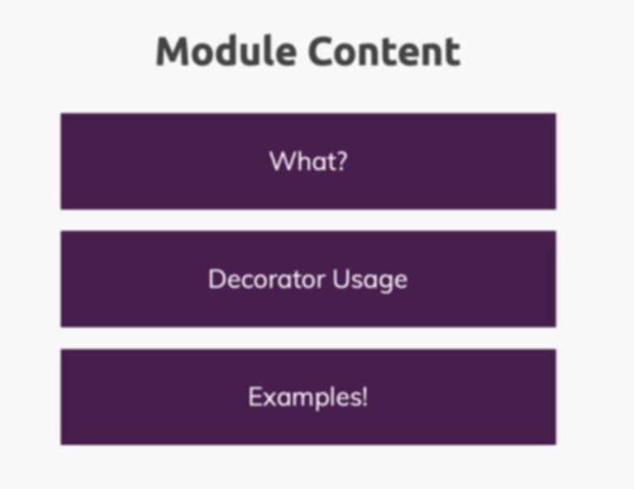

## 1 - Module Introduction



## 2 - A First Class Decorator

```ts
function Logger(constructor: Function) {
  console.log(`Logging .....`);
  console.log(constructor);
}

@Logger
class Person {
  name = "max";

  constructor() {
    console.log("creating the Person Object");
  }
}

const max = new Person();
console.log(max);
```

## 3 - Working with Decorator Factories

```ts
function Logger(loggingString: string) {
  return function (constructor: Function) {
    console.log(loggingString);
    console.log(constructor);
  };
}

@Logger("Logging Person")
class Person {
  name = "max";

  constructor() {
    console.log("creating the Person Object");
  }
}

const max = new Person();
console.log(max);
```

## 4 - Building More Useful Decorators

```ts
function WithTemplate(template: string, hookId: string) {
  return function (constructor: any) {
    const p = new constructor();

    const hookEl = document.getElementById(hookId);
    if (hookEl) {
      hookEl.innerHTML = template;
      hookEl.querySelector("h1")!.textContent = p.name;
    }
  };
}

// @Logger("Logging Person")
@WithTemplate("<h1>hello there</h1>", "hook")
class Person {
  name = "max";
  constructor() {
    console.log("creating the Person Object");
  }
}

const max = new Person();
```

## 5 - Adding Multiple Decorators

runns bottoms first

```ts
@Logger("Logging Person")
@WithTemplate("<h1>hello there</h1>", "hook")
class Person {
  name = "max";
  constructor() {
    console.log("creating the Person Object");
  }
}
```

1 template
2 logger

## 6 - Diving into Property Decorators

```ts
function Log(target: any, propertyName: string | Symbol) {
  console.log("Proprety Decorator");
  console.log("target", target);
  console.log("pname", propertyName);
}

class Person {
  @Log
  name: string;
  private price: number;

  public set setPrice(v: number) {
    this.price = v;
  }

  constructor(t: string, p: number) {
    this.name = t;
    this.price = p;
  }

  priceWithTax(tax: number) {
    return this.price * tax;
  }
}
```

## 7 - Accessor Parameter Decorators

```ts
function Log(target: any, propertyName: string | Symbol) {
  console.log("Proprety Decorator");
  console.log("target", target);
  console.log("pname", propertyName);
}

function Log2(target: any, name: string, descriptor: PropertyDescriptor) {
  console.log("Accessor Decorator");
  console.log("target", target);
  console.log("name", name);
  console.log("descriptor", descriptor);
}
function Log3(target: any, name: string, descriptor: PropertyDescriptor) {
  console.log("Method Decorator");
  console.log("target", target);
  console.log("name", name);
  console.log("descriptor", descriptor);
}
function Log4(target: any, name: string, posistion: number) {
  console.log("Parameter Decorator");
  console.log("target", target);
  console.log("name", name);
  console.log("posistion", posistion);
}
class Person {
  @Log
  name: string;
  private price: number;

  @Log2
  public set setPrice(v: number) {
    this.price = v;
  }

  constructor(t: string, p: number) {
    this.name = t;
    this.price = p;
  }
  @Log3
  priceWithTax(@Log4 tax: number) {
    return this.price * tax;
  }
}
```

## 8 - When Do Decorators Execute

when u define the decorators they run

## 9 - Returning (and changing) a Class in a Class Decorator

```ts
function WithTemplate(template: string, hookId: string) {
  return function <T extends { new (...args: any[]): { name: string } }>(
    originalConstructor: T
  ) {
    // here we can return a new originalConstructor function
    return class extends originalConstructor {
      constructor(..._args: any[]) {
        super();
        console.log("Running the Template Dec");
        const hookEl = document.getElementById(hookId);
        if (hookEl) {
          hookEl.innerHTML = template;
          hookEl.querySelector("h1")!.textContent = this.name;
        }
      }
    };
  };
}

@WithTemplate("<h1>hello there</h1>", "hook")
class Person {
  name = "max";
  constructor() {
    console.log("creating the Person Object");
  }
}

const max = new Person();
```

## 10 - Other Decorator Return Types

we can use decoratoes with function and accesor functions

## 11 - Example Creating an Autobind Decorator

```ts
function AutoBind(_target: any, _name: string, descriptor: PropertyDescriptor) {
  const originalMethod = descriptor.value;

  const _modifiedDescriptor: PropertyDescriptor = {
    configurable: true,
    enumerable: false,
    get() {
      const bindFunction = originalMethod.bind(this);
      return bindFunction;
    },
  };

  return _modifiedDescriptor as TypedPropertyDescriptor<() => void>;
}

class Printer {
  name = "this works";

  @AutoBind
  onmessage() {
    console.log("name ->" + this.name);
  }
}

const printer = new Printer();

const button = document.querySelector("button");

button?.addEventListener("click", printer.onmessage);
```

## 12 - Validation with Decorators - First Steps

```ts

```

## 13 - Validation with Decorators - Finished

```ts

```
