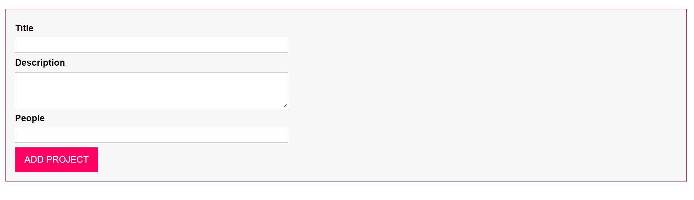

2 - Getting Started
setup the app
3 - DOM Element Selection OOP Rendering

```html
<!DOCTYPE html>
<html lang="en">
  <head>
    <meta charset="UTF-8" />
    <meta name="viewport" content="width=device-width, initial-scale=1.0" />
    <meta http-equiv="X-UA-Compatible" content="ie=edge" />
    <title>ProjectManager</title>
    <link rel="stylesheet" href="./app.css" />
    <script src="./dist/app.js" defer></script>
  </head>
  <body>
    <template id="project-input">
      <form>
        <div class="form-control">
          <label for="title">Title</label>
          <input type="text" id="title" />
        </div>
        <div class="form-control">
          <label for="description">Description</label>
          <textarea id="description" rows="3"></textarea>
        </div>
        <div class="form-control">
          <label for="people">People</label>
          <input type="number" id="people" step="1" min="0" max="10" />
        </div>
        <button type="submit">ADD PROJECT</button>
      </form>
    </template>
    <template id="single-project">
      <li></li>
    </template>
    <template id="project-list">
      <section class="projects">
        <header>
          <h2></h2>
        </header>
        <ul></ul>
      </section>
    </template>
    <div id="app"></div>
  </body>
</html>
```

```ts
class ProjectInput {
  templateElement: HTMLTemplateElement;
  rootElement: HTMLDivElement;
  element: HTMLFormElement;
  constructor() {
    this.templateElement = document.getElementById(
      "project-input"
    ) as HTMLTemplateElement;

    this.rootElement = document.getElementById("app") as HTMLDivElement;
    const importNode = document.importNode(this.templateElement.content, true);

    this.element = importNode.firstElementChild as HTMLFormElement;
    this.element.id = "user-input";
    this.attach();
  }

  private attach() {
    this.rootElement.insertAdjacentElement("afterbegin", this.element);
  }
}

const project = new ProjectInput();
```

**output**


4 - Interacting with DOM Elements

```ts
this.element = importNode.firstElementChild as HTMLFormElement;
this.element.id = "user-input";
this.attach();
```

5 - Creating Using an Autobind Decorator

```ts
function AutoBind(_target: any, _name: string, descriptor: PropertyDescriptor) {
  const originalMethod = descriptor.value;

  const _modifiedDescriptor: PropertyDescriptor = {
    configurable: true,
    enumerable: false,
    get() {
      const bindFunction = originalMethod.bind(this);
      return bindFunction;
    },
  };

  return _modifiedDescriptor as TypedPropertyDescriptor<() => void>;
}


  //   @AutoBind
  private handleSubmit(event: Event) {
    event.preventDefault();
    console.log(this.titleElementInput.value);
  }

```

6 - Fetching User Input

```ts
interface Validatable {
  value: string | number;
  required?: boolean;
  minLength?: number;
  maxLength?: number;
  min?: number;
  max?: number;
}

function validate(validateInput: Validatable) {
  let isValid = true;

  if (validateInput.required) {
    isValid = isValid && validateInput.value.toString().trim().length > 0;
  }

  if (
    validateInput.maxLength != null &&
    typeof validateInput.value === "string"
  ) {
    isValid =
      isValid &&
      validateInput.value.toString().trim().length <= validateInput.maxLength;
  }

  if (
    validateInput.minLength != null &&
    typeof validateInput.value === "string"
  ) {
    isValid =
      isValid &&
      validateInput.value.toString().trim().length >= validateInput.minLength;
  }
  if (validateInput.min != null && typeof validateInput.value === "number") {
    isValid = isValid && validateInput.value >= validateInput.min;
  }
  if (validateInput.max != null && typeof validateInput.value === "number") {
    isValid = isValid && validateInput.value <= validateInput.max;
  }

  return isValid;
}

    const titleValidatable: Validatable = {
      value: titleElement,
      required: true,
    };
    const descriptionValidatable: Validatable = {
      value: descriptionElement,
      required: true,
      minLength: 5,
    };
    const peopleValidatable: Validatable = {
      value: peopleElement,
      required: true,
      min: 1,
      max: 5,
    };
    const peopleValidatable: Validatable = {
      value: peopleElement,
      required: true,
      min: 1,
      max: 5,
    };
    if (
      !validate(titleValidatable) ||
      !validate(descriptionValidatable) ||
      !validate(peopleValidatable)
    ) {
      alert("Invalid Input please try again!");
      return;
    } else {
      return [titleElement, descriptionElement, +peopleElement];
    }
  }
```

7 - Creating a Re-Usable Validation Functionality

```ts

```

8 - Rendering Project Lists

```ts

```

9 - Managing Application State with Singletons

```ts

```

10 - More Classes Custom Types

11 - Filtering Projects with Enums

```ts

```

12 - Adding Inheritance Generics

```ts

```

13 - Rendering Project Items with a Class

```ts

```

14 - Using a Getter

```ts

```

15 - Utilizing Interfaces to Implement Drag Drop

```ts

```

16 - Drag Events Reflecting the Current State in the UI

```ts

```

17 - Adding a Droppable Area

```ts

```

18 - Finishing Drag Drop

```ts

```

19 - Wrap Up
